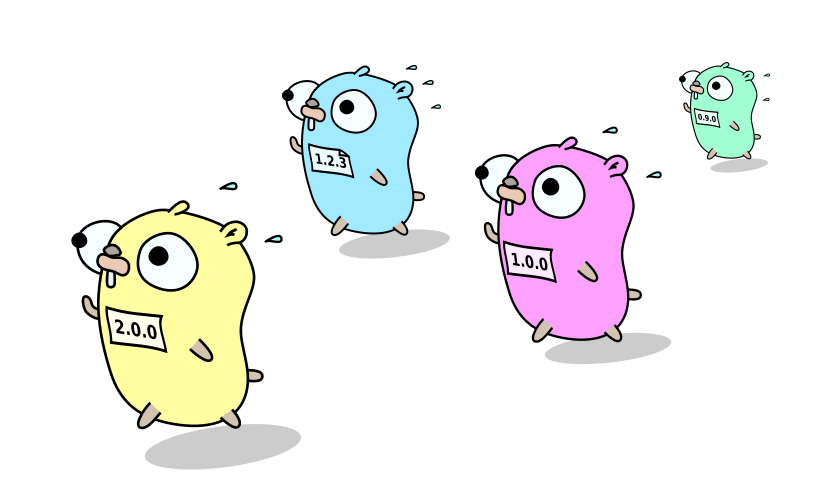

# go-semver

[](https://goreportcard.com/report/adamwasila/go-semver) [](https://travis-ci.com/adamwasila/go-semver) [](https://coveralls.io/github/adamwasila/go-semver?branch=master)  

Simple version string parser, bulider, bumper etc. Follows strictly [semantic Versioning 2.0.0 specification](https://semver.org/) and has unit tests to ensure it works for most edge cases.

> Note: this isn't stable version yet. It should do the job and all tests are passing but API will be freezed only after version 1.0.0 tag. No promises till that point.

## Features

- Validate version stored in a string.
- Parse and unpack to standarized `Version` structure where it can be easily introspected or used for higher "business" logic.
- Bump parsed structure to next version.
- Operator to compare two versions: allows choosing max version, sorting etc.

## Install

Run `go get github.com/adamwasila/go-semver`

## Requirements

go 1.15 or newer is preferred. Run all unit tests first before using any older version of go.

## Examples

Create new semver struct:

```go
sv, _ := semver.New(
    semver.SetCore("1.2.3"),
    semver.Prerelease("rc.1"), semver.BuildMetadata("cafebabe"),
)
fmt.Printf("%s", sv.String())
```

Output:

```console
1.2.3-rc.1+cafebabe
```

Parse string with version (will panic if version is incorrect):

```go
v := "1.2.3-ver.12a+build.1234"
sv := semver.MustParse(v)
fmt.Printf("%s == %s", v, sv.String())
```

Output:

```console
1.2.3-ver.12a+build.1234 == 1.2.3-ver.12a+build.1234
```

Bump version:

```go
sv := semver.MustParse("1.2.3-rc.1+cafebabe")
sv, _ = sv.Bump(semver.BreakingChange)
fmt.Printf("%s", sv.String())
```

Output:

```console
2.0.0
```

## Tools

There are few commandline tools available built with help of this library stored in this repository. These can be regarded as example of library use but should be useful as standalone tools used for release scripting.

### semver-verify

Validates versions specified in argument list returning error code and description of each version that does not follow semver 2.0 format strictly.

Example of use:

```console
$ semver-verify 1.0.0 2.1.1 3.0.0-rc.1 4.0.0-invalid.~

Invalid version: '4.0.0-invalid.~', error at position 14: invalid character in prerelease identifier: '~'
```

### semver-sort

Reads standard input with list of versions, sorts them accordingly and returns the result. Have few flags to customize output as shown in following examples:

Sort list of versions, plain and simple (default behaviour):

```console
$ echo "17.0.0 1.2.3 2.0.0-rc.0 2.0.0-alpha.0 2.0.0-beta.0" | semver-sort

1.2.3
2.0.0-alpha.0
2.0.0-beta.0
2.0.0-rc.0
17.0.0 
```

Show only the last (newest) version in the set:

```console
$ echo "3.0.0 5.0.0 17.0.0-prerelease0 17.0.0 1.2.3 2.0.0-rc.0 2.0.0-alpha.0 2.0.0-beta.0" | semver-sort -1

17.0.0
```

Show oldest version in the set:

```console
$ echo "3.0.0 5.0.0 17.0.0-prerelease0 17.0.0 1.2.3 2.0.0-rc.0 2.0.0-alpha.0 2.0.0-beta.0" | semver-sort -1 -r

1.2.3
```

### semver-bump

Reads single version given as argument and bump it to next version with help of specified flags.

If no specific flag given will attempt to bump into next patch version.

Examples:

```console
$ semver-bump -major 2.4.16

3.0.0
```

```console
$ semver-bump -meta `git rev-parse HEAD` -patch 1.2.3

1.2.4+e8175a115ddbb63de0d34003ed0acde9cd66e21f
```

```console
$ semver-bump -release 2.0.0-rc.0

2.0.0
```

## License

Distributed under Apache License Version 2.0. See [LICENSE](LICENSE) for more information.

## Contact

To discuss about bugs or features: please fill gitlab issue ticket.

Pull Requests except for trivial (eg. typo) fixes should also be discussed by opening issue first.
